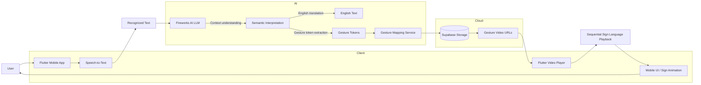

# Architecture Overview

This project uses a mobile-first pipeline where spoken Indonesian is converted into sign-language video output using speech recognition, AI-based interpretation, and cloud-managed gesture assets.

## Flow Summary

1. The user speaks into the Flutter app.
2. Speech is transcribed by the speech recognition layer.
3. The Fireworks AI model interprets the sentence, translates it, and extracts gesture tokens.
4. Each token is matched to a gesture video stored in Supabase.
5. The app plays the corresponding sign-language videos sequentially to present the message visually.
